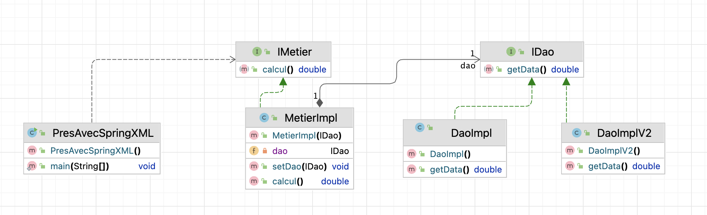

# 🌱 Spring Dependency Injection Demo

This project demonstrates **Dependency Injection (DI)** and **Inversion of Control (IoC)** using the **Spring Framework**. It covers multiple approaches to injecting dependencies between objects, including:

- 💡 XML-based configuration
- 🧩 Annotation-based configuration
- 🔧 Manual instantiation (static & dynamic)

---

## 📝 Description

This is a lightweight Java project structured to demonstrate how **loose coupling** is achieved in enterprise applications through interfaces and dependency injection.
The project follows a layered architecture:

- **DAO Layer** for data access logic
- **Business Layer (Metier)** for processing
- **Presentation Layer** to trigger execution

Spring's IoC container is used to manage object creation and wiring, instead of doing it manually in code.

---

## 🛠️ Technologies Used

| Tool / Framework     | Purpose                        |
|----------------------|--------------------------------|
| Java                 | Core language                  |
| Spring Core (IoC)    | Dependency injection container |
| Maven                | Dependency & build management  |
| UML                  | Class diagram design           |
| IntelliJ IDEA        | IDE used for development       |

---

## 🧠 Core Concepts Demonstrated

- **Loose Coupling** via Interfaces (`IDao`, `IMetier`)
- **Manual Dependency Injection**
    - Static instantiation (`PresStatic`)
    - Dynamic instantiation using Reflection (`PresDyn`)
- **Spring XML Configuration** (`applicationContext.xml`)
- **Spring Annotation Configuration** (`@Component`, `@Autowired`)
- **Swappable DAO Implementations** (`DaoImpl`, `DaoImplV2`)

---

## 📷 UML Class Diagram

> This UML diagram illustrates interface-based design and how Spring manages dependencies through injection.

---

